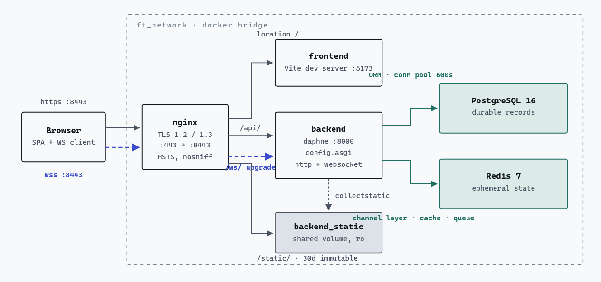
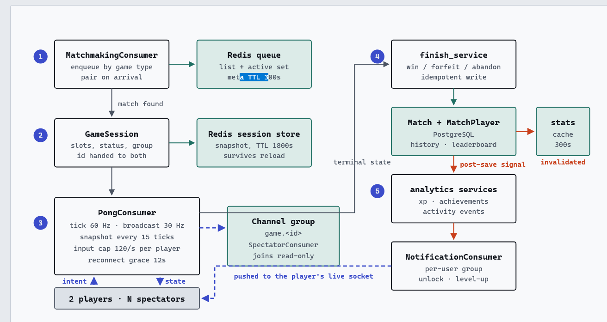
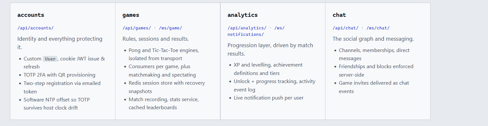
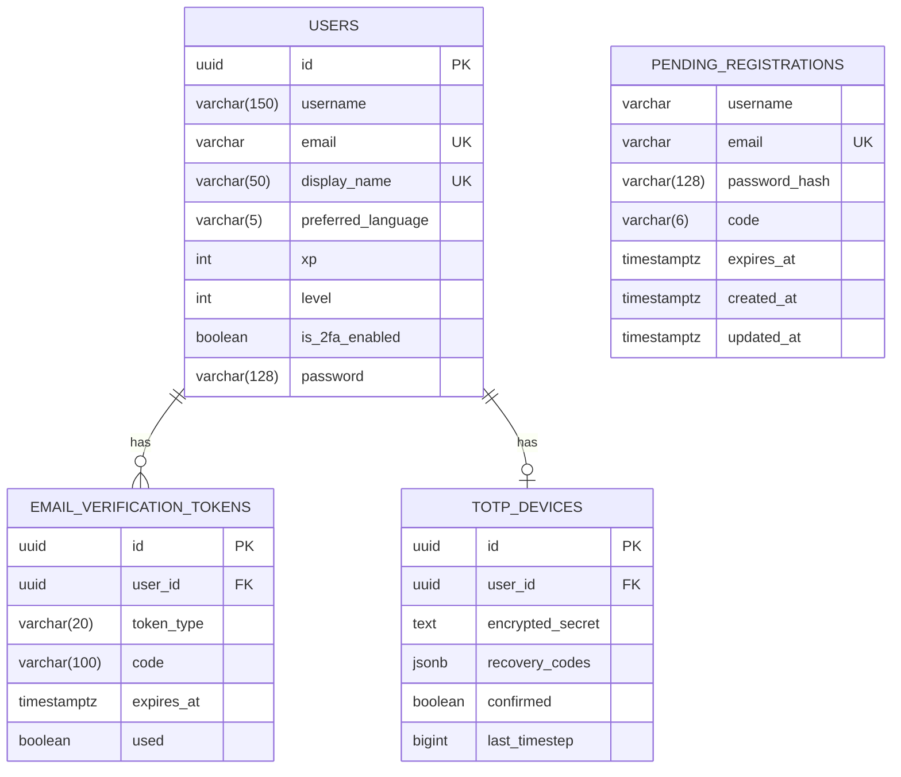
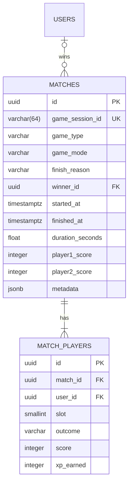
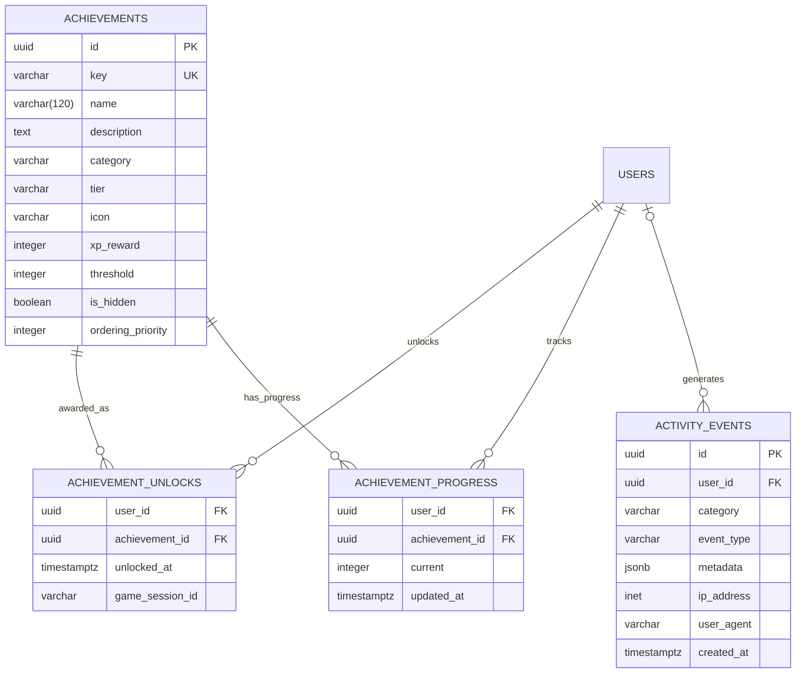
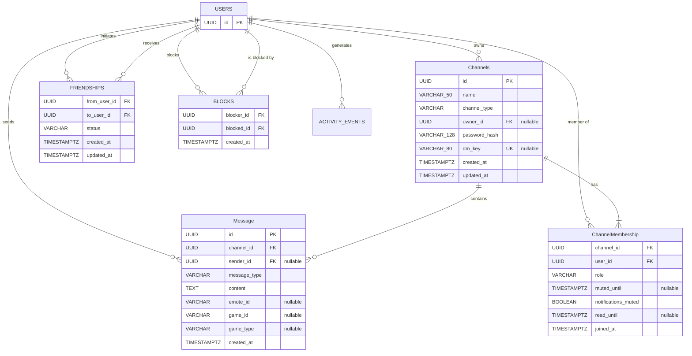

*This project has been created as part of the 42 curriculum by [hkheired](https://www.linkedin.com/in/hasan-kheireddin), [nabbas](https://www.linkedin.com/in/nathan-abbas-7581902a4/), [mjamil](https://www.linkedin.com/in/mohamad-jamil-8ba7bb33a/), [rchalak](https://github.com/reemshalak)*

# ft_transcendence – Fire Arena

<h2 style="border-bottom: none;">
Table of Contents
</h2>

- [Description](#description)
- [Team Information](#team-information)
- [Project Management](#project-management)
- [Technical Stack](#technical-stack)
- [Architecture](#architecture)
- [Database Schema](#database-schema)
- [Features](#features)
- [Modules](#modules)
- [Individual Contributions](#individual-contributions)
- [Installation & Instructions](#installation--instructions)
- [Resources](#resources)

# Description

## Project Overview & Main Goal

**Fire Arena** is a web-based multiplayer gaming platform inspired by the classic Pong and TicTacToe games.
The objective of the platform is to provide users with a complete online gaming experience where they can create accounts, interact with other players, play real time matches and track their performance.

This application is made up of the backend, frontend, database and realtime communication between connected users.

The Project was developed as part of the 42 curriculum and focuses on web development, real time communication, authentication multiplayer gaming, and modern software architecrture.

Our main goal as gaming platform is to create an engaging multiplayer experience where users can:

- Create and manage their accounts.
- Login Securely.
- Find, add, and Interact with other players.
- Play Pong and TicTakToe matches in real time.
- View their profiles and game informations.
- Track their match history and statistics.
- Watch and support their friend's game.

---

# Team Information

The project was developed by a team 4 students.

| Developer | Role | Responsibilities
| --------- | --------------------------- | -------------------------------------------------- |
| **hkheired** | Tech Lead/Backend Developer | System architecture, Django/DRF backend, WebSocket infrastructure, auth(JWT/2FA) |
| **mjamil** | Frontend Developer | React UI architecture, design system, i18n/RTL, cross browser support |
| **nabbas** | Product Owner and Manager | Pong game logic, analytics and gamification |
| **rchalak** | Full Stack Developer | 3D graphics, spectator mode, friends and chat system |

# Project Management

## Task Organization

The group opted for an iterative project management approach, which was divided into weekly planning cycles:

Weekly meetings were held to discuss project progress, identify any issues, and plan further activities.
Project features were split into smaller, more achievable tasks.
These tasks were assigned to team members according to their qualifications and availability.

## Project Management Tools

- GitHub Issues For task tracking.
- Git for version control
- WhatsApp for daily communication and meetings

## Meetings

The team held weekly meetings to review progress, discuss completed tasks and plan upcoming work.

# Technical Stack

## Architecture Overview

The project follows a **full-stack modular architecture** with real-time capabilities, secure authentication, and scalable infrastructure.

### Frontend Technologies

- **Framework:** React 18 (with Vite)
- **Language:** TypeScript
- **Routing:** React Router
- **Styling:** Tailwind CSS
- **3D Graphics:** Babylon.js
- **UI & Icons:** Lucide React
- **Internationalization:** i18next
    - Supported languages: **EN, FR, DE, AR**
    - Includes **RTL (Right-to-Left) support**

React was chosen for its component model and mature ecosystem, Typescript for compile time safety across a codebase shared by several developers, and Vite for its near-instant hot-module reload, which kept iteration fast during UI development.

### Backend Technologies

- **Runtime:** Python 3.12
- **Framework:** Django 5.1
- **API:** Django REST Framework
- **Authentication:** SimpleJWT
- **Async Support:** Django Channels
- **ASGI Server:** Daphne

Django was selected for its ORM, migrations,and authentication layer removed a large amount of boilerplate, while Channels let us add real-time gameplay and notifications without introducing a second backend runtime alongside the REST API.

### Database

- **PostgreSQL 16**
- Relational schema with structured game, user, and analytics data.

### Real-Time System, Cache, Sessions & Queues

- **Protocol:** WebSockets (via Django Channels)
- **Channel Layer:** Redis

### DevOps

- **Docker & Docker Compose**
- **Nginx**
- **SSL**
- **Makefile**

# Architecture

The project follows a **full-stack modular architecture** with real-time capabilities, secure authentication, and scalable infrastructure.

## Deployment Architecture

Five containers on one bridge network, with exactly one published port. Nginx terminates TLS and is the only thing the browser ever talks to — it splits traffic by path prefix, so the app is same-origin end to end and the JWT can live in a Secure HttpOnly cookie instead of localStorage.


### The match loop

Gameplay is server-authoritative: the client sends intent (up, down, stop), never position. The consumer owns the physics, steps it on a fixed timestep, and broadcasts snapshots at half the tick rate. This is the one genuinely sequential part of the system, so it's numbered.


### Backend Architecture

The backend is a Django monolith with a REST API, WebSocket consumers, and a PostgreSQL database. The Django ORM is used for all database interactions, and migrations are used to manage schema changes. The backend is responsible for user authentication, game logic, match history, and analytics.


# Database Schema

The database schema is designed around four domains.

## Identity & Authentication



## Gameplay & Match History



### Gamification & Analytics



### Social & Chat



# Features

| NB | Feature | Developer(s) | Description |
| -- | --------- | -------------- | ------------- |
| 1 | User Authentication | hkheired(backend), mjamil(UI) | Signup create a pending registration row with a verification code, email verification, login with JWT, resend verification, expired verification, forgot password, reset password, terms and conditions, privacy policy, Two-Factor Authentication |
| 2 | Abuse Prevention | hkheired | Rate limiting and Password/username validation |
| 3 | Server-authoritative Pong Engine | nabbas | Server-side game logic for Pong, including ball physics, paddle movement, scoring, and game state management. |
| 4 | Server-authoritative TicTacToe Engine | nabbas | Server-side game logic for TicTacToe, including win detection, move validation, and game state management. |
| 5 | 3D Pong rendering | rchalak | 3D graphics rendering for Pong using Babylon.js, including paddle and ball models, lighting, and camera controls. |
| 5 | 3D Pong rendering | rchalak | 3D graphics rendering for Pong using Babylon.js, including paddle and ball models, lighting, and camera controls. |
| 6 | 3D Spectator Mode | rchalak | 3D spectator mode for Pong, allowing users to watch live matches from different camera angles and perspectives. |
| 7 | Real-time Multiplayer Gameplay | hkheired | WebSocket-based communication for real-time gameplay, including player actions, game state updates, and match results. |
| 8 | Match History & Analytics | nabbas | Tracking and displaying match history, player statistics, and performance metrics, including win/loss records, scores, and achievements. |
| 9 | Gamification | nabbas | Implementing gamification elements such as experience points (XP), levels, achievements, and leaderboards to enhance user engagement and motivation. |
| 10 | Friends & Chat System | rchalak | Implementing a friends and chat system, allowing users to add friends, block users, send messages, invite friends to matches  and emotes |
| 11 | Design System & UI | mjamil | Creating a consistent design system and user interface for the application, including layout, typography, color scheme, and responsive design. |
| 12 | Legal & Privacy Compliance | hkheired | Ensuring the application complies with relevant legal and privacy regulations. |
| 13 | Internationalization & RTL Support | mjamil | Implementing internationalization (i18n) support for multiple languages, including right-to-left (RTL) layout support for languages such as Arabic. |
| 14 | Cross-Browser Support | mjamil | Ensuring the application works correctly across different web browsers. |
| 15 | Deployment & DevOps | hkheired | Setting up deployment pipelines, configuring servers, and managing infrastructure for the application. |

# Modules

The project is divided into several modules, each responsible for a specific aspect of the application and all developers contributed with each other to some modules, but each developer had a main module that they were responsible for:

## All team

- Major: Use a framework for both the frontend and backend.

We choose to use React for the frontend and Django for the backend, leveraging their respective strengths in building modern web applications.

## hkheired part

- Major: Implement real-time features using WebSockets or similar technology.
    - Real-time updates across clients.
    - Handle connection/disconnection gracefully.
    - Efficient message broadcasting.

A lot of this platform depends on things happening live. Game moves, matchmaking, notifications, spectating, and none of that works well with a normal request/response API where the browser has to keep asking "did anything change yet?". WebSockets let the server push updates to users the moment something happens, which is what makes the platform feel real-time instead of laggy or manual.

- Major: Remote players — Enable two players on separate computers to play the same game in real-time.
    - Handle network latency and disconnections gracefully.
    - Provide a smooth user experience for remote gameplay.
    - Implement reconnection logic.

A gaming platform where you can only play against someone sitting at the same keyboard isn't really an online platform, so remote play is what makes the whole product make sense. It also builds directly on the WebSocket work.

- Minor: Use an ORM for the database

Using an ORM instead of writing raw SQL keeps the database code safer and easier to maintain. It automatically protects against SQL injection, makes the code more readable, and makes it much easier to change the database structure later without rewriting a lot of queries by hand.

- Minor: Implement a complete 2FA system for the users.

Passwords alone aren't enough to keep accounts safe, especially since this platform stores personal data and connects to other users. Adding 2FA gives users a way to protect their account even if their password is ever leaked or guessed, which is a standard expectation for any modern authentication system.

## mjamil part

- Minor: Support for multiple languages (at least 3 languages).
    - Implement i18n (internationalization) system.
    - At least 3 complete language translations.
    - Language switcher in the UI.
    - All user-facing text must be translatable.

- Minor: Right-to-left (RTL) language support.
    - Support for at least one RTL language (Arabic)
    - Complete layout mirroring (not just text direction).
    - RTL-specific UI adjustments where needed.
    - Seamless switching between LTR and RTL.

- Minor: Support for additional browsers.
    - Full compatibility with at least 2 additional browsers (Firefox, Brave).
    - Test and fix all features in each browser.
    - Document any browser-specific limitations.
    - Consistent UI/UX across all supported browsers.

- Minor: Implement advanced search functionality with filters, sorting, and pagination

- Minor: Custom-made design system with reusable components, including a proper color palette, typography, and icons (minimum: 10 reusable components).

Why We Chose These Minors

**1. Multi-language support**

    We picked this because we wanted the application to be accessible to users from different backgrounds and not be limited to a single language. It also makes the project feel more like a real-world application. We implemented 4 languages with a language switcher and made all user-facing text translatable.

**2. RTL language support**

    We picked this because Arabic is an important language for our users and supporting it properly makes the application more accessible. We wanted more than just changing the text direction, so the entire layout adapts to RTL, including navigation, alignment, spacing, and other UI elements.

**3. Additional browser support**

    We picked this because users should be able to use the application regardless of which modern browser they prefer. Testing Firefox and Brave in addition to Chrome helped us find compatibility issues and make sure the UI and features work consistently across browsers.

**4. Advanced search**

    We picked this because the application contains a lot of information, such as players, matches, and game-related data. As the amount of data increases, finding specific information becomes harder. Search with filters, sorting, and pagination makes the application easier and faster to navigate.

**5. Custom-made design system**

    We picked this because the project has many pages and features, and we wanted the whole application to have a consistent look and feel. A reusable design system allows us to share the same colors, typography, icons, and components across the project, while also making the frontend easier to maintain and update.

## nabbas part

- Major: Implement a complete web-based game where users can play against each other.
    - The game can be real-time multiplayer (Pong)
    - Players must be able to play live matches.
    - The game must have clear rules and win/loss conditions.
    - The game can be 2D or 3D.

Pong was chosen as our main game because its rules are simple and easy for anyone to understand, but building it properly still requires real-time networking, which is a core requirement of the project.

- Major: Add another game with user history and matchmaking.(TicTacToe)
    - Implement a second distinct game.
    - Track user history and statistics for this game.
    - Implement a matchmaking system.
    - Maintain performance and responsiveness.

We chose Tic-Tac-Toe as the second game because it works very differently from Pong. It's turn-based instead of real-time which shows that our game system isn't just built for Pong specifically. It's also simple enough that we could fully add match history and matchmaking for it without extra complexity.

- Minor: Game statistics and match history (requires a game module).
    - Track user game statistics (wins, losses, ranking, level, etc.).
    - Display match history (1v1 games, dates, results, opponents).
    - Show achievements and progression.
    - Leaderboard integration

This module goes hand in hand with the two games above. Without saving match history, the gamification system wouldn't have anything to check achievements or streaks against, and players wouldn't be able to see how they've been performing over time.

- Minor: A gamification system to reward users for their actions.
    - Implement achievements, leaderboards, XP/level system.
    - System must be persistent (stored in database)
    - Visual feedback for users (notifications, progress bars)
    - Clear rules and progression mechanics.

We picked this because just winning or losing a game isn't very motivating on its own. Adding achievements, levels, and a leaderboard gives players a reason to keep coming back and keep playing. It also connects directly to the two games below instead of being a separate, disconnected feature.We implemented 22 achievements across the two games also XP/Level system was implemented as a quadratic XP curve so each level takes progressively more effort, with XP awarded for playing, winning, streaks, and game-specific bonuses and a global ranking by XP for leaderboard. All progress, achievements, unlocks, and player activity are saved permanently, and unlocks/XP gains/level-ups are pushed to the client live over WebSockets so the player sees visual feedback immediately instead of on next page load.

## rchalak part

- Major: Allow users to interact with other users. The minimum requirements are:
    - A basic chat system (send/receive messages between users)
    - A profile system (view user information).
    - A friends system (add/remove friends, see friends list).

- Major: Implement advanced 3D graphics using a library like Three js or Baby-lon.js.
    - Create an immersive 3D environment.
    - Implement advanced rendering techniques.
    - Ensure smooth performance and user interaction.

- Minor: Advanced chat features (enhances the basic chat from "User interaction"module).
    - Ability to block users from messaging you.
    - Invite users to play games directly from chat.
    - Access to user profiles from chat interface.
    - Chat history persistence.
    - Typing indicators and read receipts

- Minor: Implement spectator mode for games.
    - Allow users to watch ongoing games.
    - Real-time updates for spectators.
    - Optional: spectator chat.

These modules were chosen because we wanted to make the platform feel more alive, social, and engaging. The 3D experience adds creativity and visual depth, while the chat and friends features encourage players to interact, invite each other, and keep coming back. Spectator mode also adds another way for players to stay involved even when they aren't playing.

### point Calculation

- Major: 14 points
- Minor: 11 points
- Total: 25 points

# Individual Contributions

## hkheired Contributions

I worked on the backend foundation and everything real-time: system architecture, authentication, WebSocket infrastructure, matchmaking, remote-player gameplay, and the deployment/DevOps setup, plus legal & privacy compliance, also contributed across the stack where needed.

**Challenges I faced:**

1. Redis-based matchmaking, built from zero prior experience with it. Building a queue-based matchmaking flow on Redis meant learning its pub/sub and data-structure model while making sure matched players both landed in the same game session reliably. It was solved iteratively: get a basic queue working first, then harden it by linking it correctly into the WebSocket game's session lifecycle so a match, once formed, couldn't desync between the two clients.

2. A race condition duplicated games and XP under concurrent requests. Two near-simultaneous requests could each create their own game instance for the same match, so both got scored, doubling XP and match-result entries in the database. This surfaced only under real concurrent load, not in normal manual testing. The fix added a check-before-create guard so a second request that raced against the first would find the game already existed and attach to it instead of creating a duplicate.

3. The 3D version of Pong was built after 2D, but it reused flawed physics logic, and it had the same bugs originally seen in 2D. In online play the client and server disagreed on how big the paddle and ball actually were, so what a player saw on their screen didn't line up with where the server thought the ball/paddle. Rather than re-debugging 3D from scratch, the already-fixed 2D physics and collision logic was ported over to the 3D engine, so both games shared the same corrected math.

## mjamil Contributions

I worked mainly on the frontend using React, TypeScript, and Vite, focusing on the five assigned Minors:

Multi-language support: Implemented i18n using i18next with 4 languages: English, French, German, and Arabic. Added the language switcher and made the user-facing text translatable.
RTL support: Added full Arabic RTL support, including layout mirroring and RTL-specific adjustments. Users can switch between Arabic and LTR languages without refreshing the page.
Browser support: Tested and fixed the frontend across Chrome, Firefox, and Brave to keep the UI and features consistent.
Advanced search: Implemented search with filters, sorting, and pagination.
Custom design system: Created a reusable design system with a dark gaming theme, purple/pink color palette, typography, icons, and more than 10 reusable components.
I also built and integrated the main frontend pages, including authentication, dashboard, games, leaderboard, match history, analytics, settings, and achievements.

Challenges I faced:

Making all frontend text translatable while keeping dynamic content working correctly.
Implementing Arabic RTL properly across the whole layout, not just changing the text direction.
Keeping the design and components consistent across many different pages.
Testing the application on different browsers and fixing compatibility issues.
Making search, filters, sorting, and pagination work together correctly.

## nabbas Contributions

I owned the game layer and everything derived from match results, both server-authoritative engines, match history and statistics, and the entire gamification system.

**challenges I faced:**

1. Ball–paddle collisions in the server-authoritative Pong engine. The first working version of the physics loop had the ball behaving wrongly at contact: because the engine advances the ball by its full velocity each tick and then tests for overlap, a ball that entered the paddle box could be re-detected on the next tick and bounce twice, effectively sticking to or passing through the paddle, and each bounce compounding the speed increment made the ball unplayably fast after a long rally. It was solved with three guards: an early rejection when the ball is already moving away from that paddle, so a single contact can only register once; snapping the ball's x to the paddle's outer edge plus its radius immediately after resolving the hit, so the next tick starts outside the box; and clamping the speed with min(speed + BALL_SPEED_INCREMENT, BALL_MAX_SPEED) while deriving the outgoing angle from the normalized hit position rather than a raw reflection.
2. Analytics endpoints were hard-wired to the requesting user. The XP, achievement-stats and unlocked-achievements views were all written as /me/ routes reading request.user directly, which was correct until profiles became publicly viewable hen opening another player's profile rendered your own XP, level and achievements under their name, and the Home "Global Ranking" card showed "-#" for anyone outside the top 5 because it searched the five-row leaderboard slice instead of asking for a rank. ProfilePage was switched to call the per-user endpoints when the id isn't your own, and HomePage now reads the rank straight from xp/me/, which computes it against the whole table.

### rchalak Contributions

I owned the real-time interaction layer: the entire chat and friends system, game invites, the notification/toast stack, and the 3D gaming and spectator experience. Beyond basic chat, this included everything in the “User Interaction” and “Advanced Chat Features” modules: blocking, game invites from chat, profile access from chat, persistent chat history, typing indicators, read receipts, Babylon.js 3D rendering, spectator mode, and overall UI/UX polishing.

**challenges I faced**:

1. The same friendship state was being fetched independently by the chat widget, the full chat page and the profile page, so accepting a request in one place left the others stale until a manual refresh — and it looked like the app was "not updating". We extracted a shared FriendshipContext so all three surfaces read from and write to one source of truth, and drove every friend event (request received / accepted / removed) through WebSocket updates that mutate that shared state in real time. The same pattern was then applied to BlockContext so blocking a user immediately deletes the friendship, hides their profile ("This profile is unavailable"), disables messaging/invites and removes their online dot. The block is enforced on both sides: They can't see your profile if you blocked them and messaging/invites gate on blockedUserIds combined in both directions.

2. Two users adding each other at the same time produced two accepted friendship rows (the old uniqueness only covered A→B, not B→A), and a race in DM channel creation could create two separate channels for the same pair. We added a symmetric check on the backend that rejects a request if one already exists in either direction (from_user/to_user swapped), and made DM channel creation atomic via get_or_create() on a unique dm_key. The frontend also got a dedup guard on every optimistic list update — when adding a friendship, it checks both the id and other_user_id before inserting, so duplicates can't land locally even if the backend somehow let one through.

# Installation & Instructions

## Prerequisites

- Docker & Docker Compose installed on your machine.
- A modern web browser (Chrome, Firefox, Brave, edge).
- Node.js and npm installed (for frontend development).
- git installed (for cloning the repository).
- github account (for accessing the repository).
- MakeFile installed (for building and running the project).
- ports 8443, 5433, 6380, 3000 are available and not blocked by firewall or other applications.

## Instructions

1.Clone the repository:

```bash
git clone https://github.com/4i2e-Arena/4i2e-Arena.git
```

2.Navigate to the project directory:

```bash
cd 4i2e-Arena
```

3.Export you enviroment

```bash
cp .env.example .env
```

3.Build and start the Docker containers:

```bash
make
```

4.Access the application in your web browser at:

```web
https://localhost:8443
or
https://MACHINE_IP:8443
```

5.Create an account, verify your email, and start playing games with friends!

# Resources

- [Django Documentation](https://docs.djangoproject.com/en/5.1/)
- [Django REST Framework Documentation](https://www.django-rest-framework.org/)
- [Django Channels Documentation](https://channels.readthedocs.io/en/stable/)
- [Docker Documentation](https://www.google.com/url?sa=t&source=web&rct=j&opi=89978449&url=https://docs.docker.com/&ved=2ahUKEwjDkZ2nrZiWAxXbR_4FHSGwK3QQFnoECA4QAQ&usg=AOvVaw2o85KRImb73of1uit3agPQ)
- [TypeScript](https://www.google.com/url?sa=t&source=web&rct=j&opi=89978449&url=https://www.typescriptlang.org/docs/&ved=2ahUKEwj0g8XKrZiWAxUf9QIHHXWkJRAQFnoECAwQAQ&usg=AOvVaw20TV6LfjkMklzed6tZ3GJe)
- [Pong game Article](https://www.google.com/url?sa=t&source=web&rct=j&opi=89978449&url=https://towardsdatascience.com/coding-the-pong-game-from-scratch-in-python/&ved=2ahUKEwjl_c_mrZiWAxUa0gIHHURVEdoQFnoECCEQAQ&usg=AOvVaw3xxoYT0a_IkUVpkpCS5jlG)

We Used Artificial Intelligence in generating ERD diagrams by providing the database schema for README.md file.
