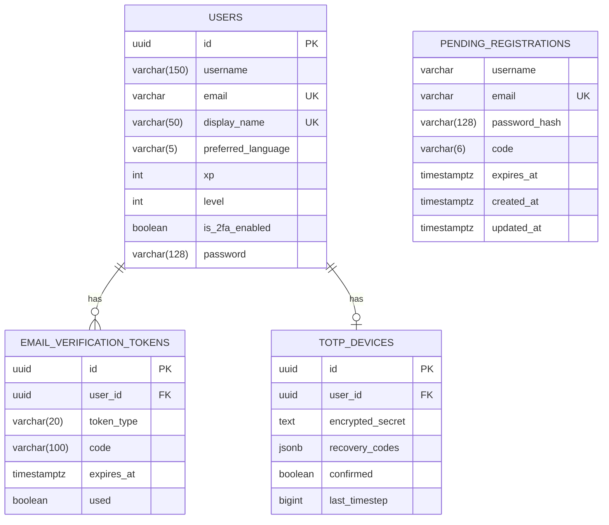
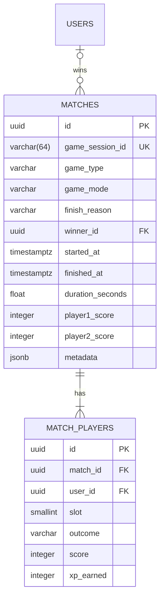
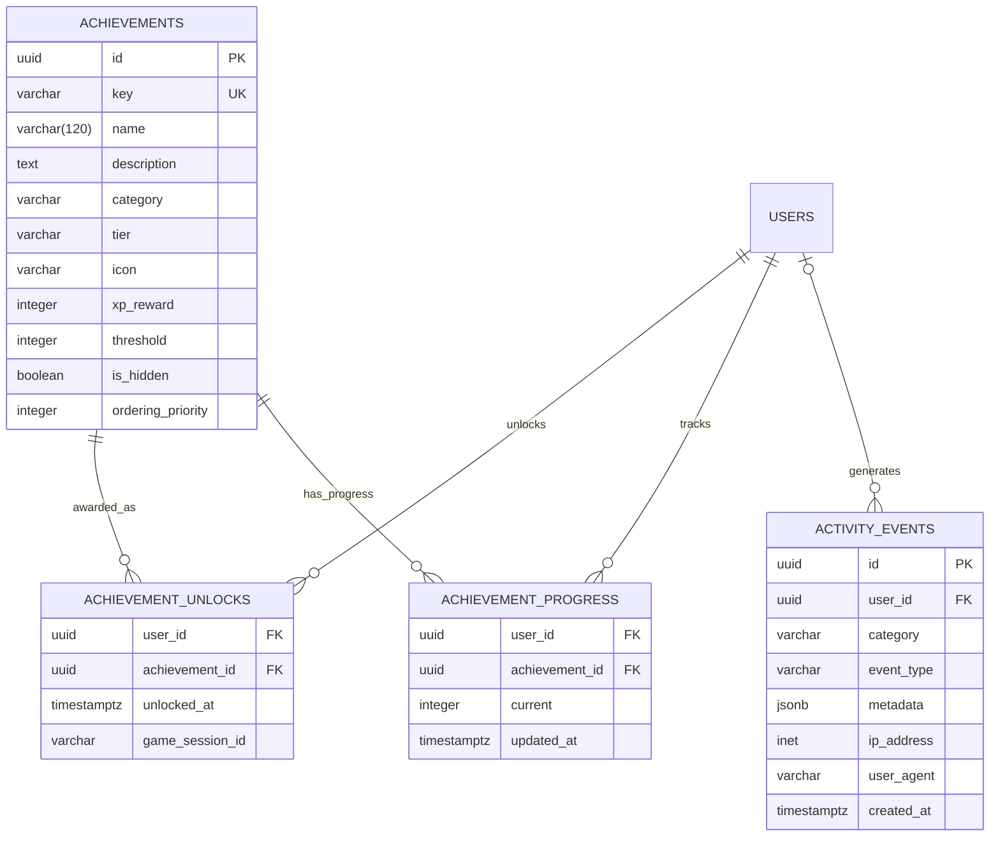
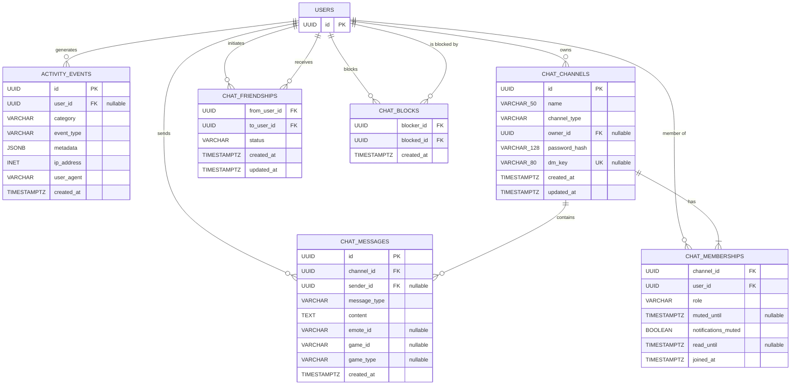

*This project has been created as part of the 42 curriculum by [hkheired](https://www.linkedin.com/in/hasan-kheireddin), [nabbas](https://www.linkedin.com/in/nathan-abbas-7581902a4/), [mjamil](https://www.linkedin.com/in/mohamad-jamil-8ba7bb33a/), [rchalak](https://github.com/reemshalak)*

# ft_transcendence – Fire Arena


<h2 style="border-bottom: none;">  Table of Contents</h2>

- [Description](#Description)
- [Team Information](#Team-Information)
- [Project Management](#Project-Management)
- [Technical Stack](#️Technical-Stack)
- [Architecture](#Architecture)
- [Database Schema](#Database-Schema)
- [Features](#Features)
- [Modules](#modules)
- [Individual Contributions](#individual-Contributions)
- [Installation & Instructions](#Installation-&-Instructions)
- [Resources](#Resources)

# Description
## Project Overview & Main Goal
**Fire Arena** is a web-based multiplayer gaming platform inspired by the classic Pong and TicTacToe games.
The objective of the platform is to provide users with a complete online gaming experience where they can create accounts, interact with other players, play real time matches and track their performance.

This application is made up of the backend, frontend, database and realtime communication between connected users.

The Project was developed as part of the 42 curriculum and focuses on web development, real time communication, authentication multiplayer gaming, and modern software architecrture.

Our main goal as gaming platform is to create an engaging multiplayer experience where users can:

- Create and manage their accounts.
- Login Securely.
- Find, add, and Interact with other players.
- Play Pong and TicTakToe matches in real time.
- View their profiles and game informations.
- Track their match history and statistics.
- Watch and support their friend's game.

<br>

# Team Information
The project was developed by a team 4 students.


| Developer | Role                        | Responsibilities
| --------- | --------------------------- |  --------------------------------------------------|
| **hkheired** | Backend Developer    | System architecture, Django/DRF backend, WebSocket infrastructure, auth(JWT/2FA)   |
| **mjamil** | Fronend Developer | React UI architecture, design system, i18n/RTL, cross browser support  |
| **nabbas** | Product Owner and Manager          | Pong game logic, analytics and gamification |
|rchalak | Full Stack Developer | 3D graphics, spectator mode, friends and chat system 

<br>

# Project Management
###  Task Organization

The group opted for an iterative project management approach, which was divided into weekly planning cycles:

Weekly meetings were held to discuss project progress, identify any issues, and plan further activities.
Project features were split into smaller, more achievable tasks.
These tasks were assigned to team members according to their qualifications and availability.

### Project Management Tools
- GitHub Issues For task tracking.
- Git for version control
- WhatsApp for daily communication and meetings

### Meetings
The team held weekly meetings to review progress, discuss completed tasks and plan upcoming work.

# Technical Stack
### Architecture Overview
The project follows a **full-stack modular architecture** with real-time capabilities, secure authentication, and scalable infrastructure.

### Frontend Technologies
* **Framework:** React 18 (with Vite)
* **Language:** TypeScript
* **Routing:** React Router
* **Styling:** Tailwind CSS
* **3D Graphics:** Babylon.js
* **UI & Icons:** Lucide React
* **Internationalization:** i18next

  * Supported languages: **EN, FR, DE, AR**
  * Includes **RTL (Right-to-Left) support**

React was chosen for its component model and mature ecosystem, Typescript for compile time safety across a codebase shared by several developers, and Vite for its near-instant hot-module reload, which kept iteration fast during UI development.

### Backend Technologies
* **Runtime:** Python 3.12
* **Framework:** Django 5.1
* **API:** Django REST Framework
* **Authentication:** SimpleJWT
* **Async Support:** Django Channels
* **ASGI Server:** Daphne

Django was selected for its ORM, migrations,and authentication layer removed a large amount of boilerplate, while Channels let us add real-time gameplay and notifications without introducing a second backend runtime alongside the REST API. 

### Database

* **PostgreSQL 16**
* Relational schema with structured game, user, and analytics data.

Postgres offers

### Real-Time System, Cache, Sessions & Queues

* **Protocol:** WebSockets (via Django Channels)
* **Channel Layer:** Redis

### DevOps

* **Docker & Docker Compose**
* **Nginx**
* **SSL**
* **Makefile**


# Architecture
The project follows a **full-stack modular architecture** with real-time capabilities, secure authentication, and scalable infrastructure.

### Deployment Architecture
Five containers on one bridge network, with exactly one published port. Nginx terminates TLS and is the only thing the browser ever talks to — it splits traffic by path prefix, so the app is same-origin end to end and the JWT can live in a Secure HttpOnly cookie instead of localStorage.


### The match loop
Gameplay is server-authoritative: the client sends intent (up, down, stop), never position. The consumer owns the physics, steps it on a fixed timestep, and broadcasts snapshots at half the tick rate. This is the one genuinely sequential part of the system, so it's numbered. 

### Backend Architecture
The backend is a Django monolith with a REST API, WebSocket consumers, and a PostgreSQL database. The Django ORM is used for all database interactions, and migrations are used to manage schema changes. The backend is responsible for user authentication, game logic, match history, and analytics.

# Database Schema
The database schema is designed around four domains.
## Identity & Authentication


## Gameplay & Match History



### Gamification & Analytics




### Social & Chat



# Features

|NB | Feature | Developer(s) | Description |
|---|---------|--------------|-------------|
| 1 | User Authentication | hkheired(backend), mjamil(UI) | Signup create a pending registration row with a verification code, email verification, login with JWT, resend verification, expired verification, forgot password, reset password, terms and conditions, privacy policy, Two-Factor Authentication |
| 2 | Abuse Prevention | hkheired | Rate limiting and Password/username validation |
| 3 | Server-authoritative Pong Engine | nabbas | Server-side game logic for Pong, including ball physics, paddle movement, scoring, and game state management. |
| 4 | Server-authoritative TicTacToe Engine | nabbas | Server-side game logic for TicTacToe, including win detection, move validation, and game state management. |
| 5 | 3D Pong rendering | rchalak | 3D graphics rendering for Pong using Three.js, including paddle and ball models, lighting, and camera controls. |
| 6 | 3D Spectator Mode | rchalak | 3D spectator mode for Pong, allowing users to watch live matches from different camera angles and perspectives. |
| 7 | Real-time Multiplayer Gameplay | hkheired | WebSocket-based communication for real-time gameplay, including player actions, game state updates, and match results. |
| 8 | Match History & Analytics | nabbas | Tracking and displaying match history, player statistics, and performance metrics, including win/loss records, scores, and achievements. |
| 9 | Gamification | nabbas | Implementing gamification elements such as experience points (XP), levels, achievements, and leaderboards to enhance user engagement and motivation. |
| 10 | Friends & Chat System | rchalak | Implementing a friends and chat system, allowing users to add friends, block users, send messages, invite friends to matches  and emotes |
| 11 | Design System & UI | mjamil | Creating a consistent design system and user interface for the application, including layout, typography, color scheme, and responsive design. |
| 12 | Legal & Privacy Compliance | hkheired | Ensuring the application complies with relevant legal and privacy regulations. |
| 13 | Internationalization & RTL Support | mjamil | Implementing internationalization (i18n) support for multiple languages, including right-to-left (RTL) layout support for languages such as Arabic. |
| 14 | Cross-Browser Support | mjamil | Ensuring the application works correctly across different web browsers. |
| 15 | Deployment & DevOps | hkheired | Setting up deployment pipelines, configuring servers, and managing infrastructure for the application. |


# Modules
The project is divided into several modules, each responsible for a specific aspect of the application and all developers contributed with each other to some modules, but each developer had a main module that they were responsible for:

- Major: Use a framework for both the frontend and backend.
<br>
We choose to use React for the frontend and Django for the backend, leveraging their respective strengths in building modern web applications.

## hkheired part
- Major: Implement real-time features using WebSockets or similar technology.
    - Real-time updates across clients.
    - Handle connection/disconnection gracefully.
    - Efficient message broadcasting.

- Major: Remote players — Enable two players on separate computers to play the same game in real-time.
    - Handle network latency and disconnections gracefully.
    - Provide a smooth user experience for remote gameplay.
    - Implement reconnection logic.

- Minor: Use an ORM for the database

- Minor: Implement a complete 2FA system for the users.

explain why you choose to done those:

## mjamil part
- Minor: Support for multiple languages (at least 3 languages).
    - Implement i18n (internationalization) system.
    - At least 3 complete language translations.
    - Language switcher in the UI.
    - All user-facing text must be translatable.

- Minor: Right-to-left (RTL) language support.
    - Support for at least one RTL language (Arabic)
    - Complete layout mirroring (not just text direction).
    - RTL-specific UI adjustments where needed.
    - Seamless switching between LTR and RTL.

- Minor: Support for additional browsers.
    - Full compatibility with at least 2 additional browsers (Firefox, Brave).
    - Test and fix all features in each browser.
    - Document any browser-specific limitations.
    - Consistent UI/UX across all supported browsers.

- Minor: Implement advanced search functionality with filters, sorting, and pagination

- Minor: Custom-made design system with reusable components, including a proper color palette, typography, and icons (minimum: 10 reusable components).

explain why you choose to done those:
## nabbas part
- Major: Implement a complete web-based game where users can play against each other.
    - The game can be real-time multiplayer (Pong)
    - Players must be able to play live matches.
    - The game must have clear rules and win/loss conditions.
    - The game can be 2D or 3D.

- Major: Add another game with user history and matchmaking.(TicTacToe)
    - Implement a second distinct game.
    - Track user history and statistics for this game.
    - Implement a matchmaking system.
    - Maintain performance and responsiveness.

- Minor: Game statistics and match history (requires a game module).
    - Track user game statistics (wins, losses, ranking, level, etc.).
    - Display match history (1v1 games, dates, results, opponents).
    - Show achievements and progression.
    - Leaderboard integration

- Minor: A gamification system to reward users for their actions.
    - Implement achievements, leaderboards, XP/level system.
    - System must be persistent (stored in database)
    - Visual feedback for users (notifications, progress bars)
    - Clear rules and progression mechanics.

Explain why you choose to done those:

## rchalak part
- Major: Allow users to interact with other users. The minimum requirements are:
    - A basic chat system (send/receive messages between users)
    - A profile system (view user information).
    - A friends system (add/remove friends, see friends list).

- Major: Implement advanced 3D graphics using a library like Three js or Baby-lon.js.
    - Create an immersive 3D environment.
    - Implement advanced rendering techniques.
    - Ensure smooth performance and user interaction.

- Minor: Advanced chat features (enhances the basic chat from "User interaction"module).
    - Ability to block users from messaging you.
    - Invite users to play games directly from chat.
    - Access to user profiles from chat interface.
    - Chat history persistence.
    - Typing indicators and read receipts

- Minor: Implement spectator mode for games.
    - Allow users to watch ongoing games.
    - Real-time updates for spectators.
    - Optional: spectator chat.

explain why you choose to done those:

### point Calculation
- Major: 14 points
- Minor: 11 points
- Total: 25 points

# Individual Contributions


# Installation & Instructions
### Prerequisites
- Docker & Docker Compose installed on your machine.
- A modern web browser (Chrome, Firefox, Brave, edge).
- Node.js and npm installed (for frontend development).
- git installed (for cloning the repository).
- github account (for accessing the repository).
- MakeFile installed (for building and running the project).
- ports 8443, 5433, 6380, 3000 are available and not blocked by firewall or other applications.

### Instructions
1. Clone the repository:
```bash
git clone https://github.com/4i2e-Arena/4i2e-Arena.git
```
2. Navigate to the project directory:
```bash
cd 4i2e-Arena
```
3. Build and start the Docker containers:
```bash
make
```
4. Access the application in your web browser at:
```
https://localhost:8443
or
https://MACHINE_IP:8443
```
5. Create an account, verify your email, and start playing games with friends!

# Resources
- [Django Documentation](https://docs.djangoproject.com/en/5.1/)
- [Django REST Framework Documentation](https://www.django-rest-framework.org/)
- [Django Channels Documentation](https://channels.readthedocs.io/en/stable/)
- [Docker Documentation](https://www.google.com/url?sa=t&source=web&rct=j&opi=89978449&url=https://docs.docker.com/&ved=2ahUKEwjDkZ2nrZiWAxXbR_4FHSGwK3QQFnoECA4QAQ&usg=AOvVaw2o85KRImb73of1uit3agPQ)
- [TypeScript](https://www.google.com/url?sa=t&source=web&rct=j&opi=89978449&url=https://www.typescriptlang.org/docs/&ved=2ahUKEwj0g8XKrZiWAxUf9QIHHXWkJRAQFnoECAwQAQ&usg=AOvVaw20TV6LfjkMklzed6tZ3GJe)
- [Pong game Article](https://www.google.com/url?sa=t&source=web&rct=j&opi=89978449&url=https://towardsdatascience.com/coding-the-pong-game-from-scratch-in-python/&ved=2ahUKEwjl_c_mrZiWAxUa0gIHHURVEdoQFnoECCEQAQ&usg=AOvVaw3xxoYT0a_IkUVpkpCS5jlG)

We Used Artificial Intelligence in generating ERD diagrams by providing the database schema for README.md file, also we use it in testing the implemented backend features by asking him to generate a temporary UI design.


### mjamil part

My part in this project is the entire frontend, built with React + TypeScript + Vite.

_Style & Theme
The whole UI uses a dark gaming aesthetic with a purple/pink neon color scheme.
All colors are defined as CSS variables so every component automatically supports dark/light mode:

Dark mode is on by default and toggled via a button that saves the preference to localStorage.

What I Built
Auth Pages

Login, Register, Forgot Password, Reset Password
Two-Factor Authentication (setup + verify)
OAuth callback (Google)

Each auth page has a split layout — form on one side, a custom image on the other. The image switches automatically between a dark version and a light version based on the current theme.
Dashboard & Layout

Navbar — search bar, notifications, user menu, dark mode toggle
Sidebar — collapsible navigation with links to all pages
Dashboard — welcome banner with XP bar, stats, quick play, recent matches, leaderboard preview

Game Pages

Pong — canvas-based game, mouse-controlled paddle, AI opponent, 2D/3D toggle
Tic-Tac-Toe — win detection, move history, score tracking

Other Pages

Play (game mode + difficulty selector)
Tournaments (brackets, registration, live status)
Leaderboard (top 3 podium + rankings table)
Match History (filters by game and result)
Analytics (weekly chart, performance metrics)
Settings (profile, security, notifications, appearance, audio)


Login & Register Images
The login and register pages use a custom split-screen layout.
The right side shows a themed image that changes based on dark/light mode:
tsx// Switches image based on current theme
src={isDark ? loginImgDark : loginImg}
Images are stored in frontend/src/images/:

loginimg.png — light mode version
loginimgDark.png — dark mode version

Languages
The UI supports 4 languages switchable from the Settings page:
en : English
fr : Français
de : Deutsch
ar : Arabic

Arabic automatically flips the page to right-to-left layout.

Tech Used

React 18 + TypeScript
Vite
React Router v6
Tailwind CSS + CSS Variables
i18next (translations)
Canvas API (Pong game)